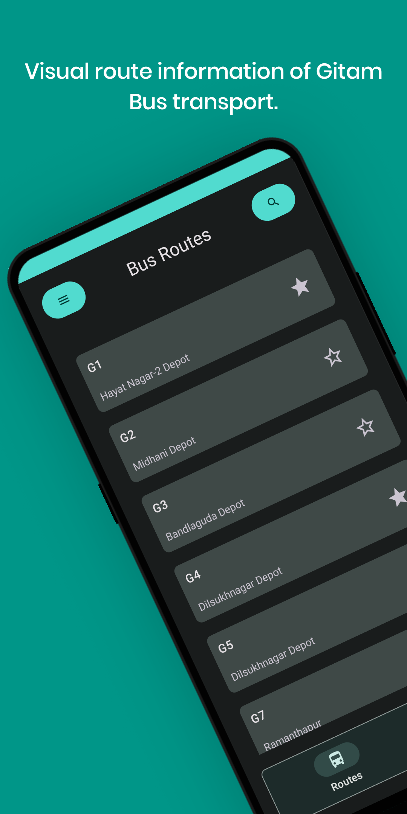
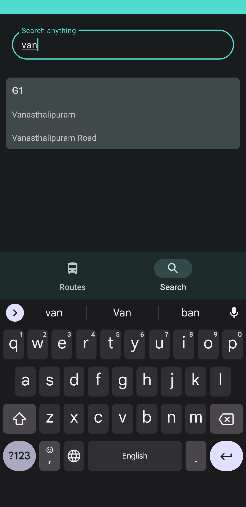
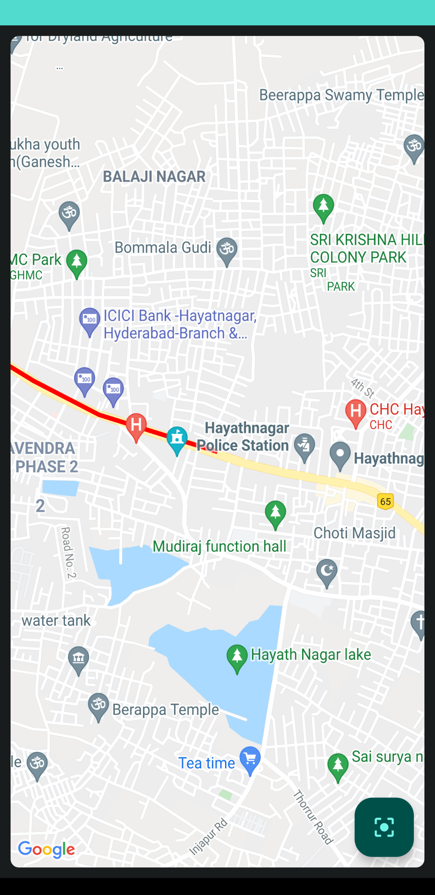

# Android-Study-Jams

Gitam Transit

<b> Problem Statement: </b>

Students usually don't know the exact routes of the busses. Since GITAM college provides the pdf with only the stop names, it's difficult for students or parents to know what's the nearest stop to them to choose the perfect bus route for them. And also if they ever miss a bus they do not know what other busses go through the same/similar route.

<b> Proposed Solution : </b>

This project proposes a system which would store the entire information of all the busses and their respective routes while having every bus stop information of the routes. This system of all the transit information at one place with visualised display of route will be helpful to many students and parents who would like to know the exact route of any bus, alternative busses if they miss the bus and what all bus stops each bus goes through. 

 
  
 

<b> Functionality & Concepts used : </b>

- RelativeLayout : Both the fragments use Relative layout because it is a very flexible layout to align views in any order instead of using nested Linear layout.
- Design / Theme : App uses the all new Material3 design components and the theme which is built using the new Material Theme Builder.
- RecyclerView : To display all the busses and also the search results efficiently.
- Google Maps API : To show the bus route on the map visually. 
- Coroutines : To move the heavy / time taking processes to a different thread and to keep the UI away from lag.
- SharedPreferences : To store most of the Bus routes data (like a cache) so it can be accessed quicker next time. 

<b> Application Link & Future Scope : </b>

The app is still being tested and more routes of busses are being added. You can get the app from [here](https://github.com/supersu-man/GitamTransit/releases/tag/Pre-alpha6) to try.

Once the app is done with adding all the Bus routes, then more information like fees, timings, etc will be added. If more people start using it then other transit options will also be added so people can pool together. People can contribute by giving information of their bus routes if there is a change in bus route or maybe a tracking system in future. 

## Contributing
You can contribute to the project by letting us know your bus route.
- Go to [Google Maps](https://www.google.com/mymaps) and create a map.
- Add directions and change the route by dragging the blue colored line (path) accordingly to match your bus route.
- Click on menu button on top left and then select "Export to KML/KMZ", tick "Export as KML" checkbox and then hit Download.
- Open the app, go to Contribution section.
- CLick on "Choose KML/GPX file" and select the downloaded .kml file.
- Wait till the progress bar fills.
- Click on "Go to Folder" and share the output.txt file with us. 
